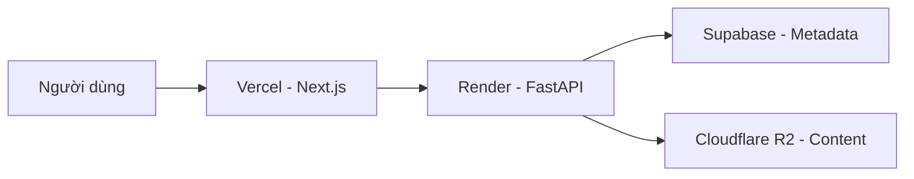

# Mạt Thế - Sinh Hoá Nguy Cơ ☣️

> *"Trong bóng tối của ngày tận thế, chỉ có ý chí mới cứu rỗi nhân loại..."*

Website đọc truyện chữ chuyên nghiệp — **Zero-cost · 1000+ CCU · Biohazard UI**

## 🏗️ Kiến Trúc



## 📁 Cấu Trúc Thư Mục

- `frontend/`: Giao diện ứng dụng (Next.js 15, Tailwind CSS)
- `backend/`: Máy chủ API (FastAPI, Python)
- `scripts/`: Công cụ xử lý dữ liệu tự động
- `.brain/`: Hệ thống kiến thức và ghi chú dự án

## 🚀 Khởi Động Nhanh

### 💻 Frontend
```bash
cd frontend
npm install
npm run dev
```

### 🐍 Backend
```bash
cd backend
pip install -r requirements.txt
uvicorn main:app --reload
```

## 🌐 Triển Khai (Deployment)

- **Frontend:** Tự động triển khai qua [Vercel](https://vercel.com) khi push code lên GitHub.
- **Backend:** Chạy trên [Render](https://render.com) kết nối trực tiếp với database Supabase.

---
**Status:** ✅ Đã hoàn tất cấu hình tên miền chính thức.
**Last Update:** 03/13/2026.