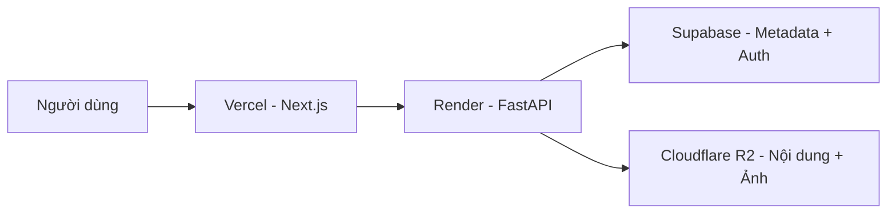

# Mạt Thế - Sinh Hoá Nguy Cơ

Website đọc truyện + quản trị nội dung cho dự án **Mạt Thế - Sinh Hoá Nguy Cơ**.

- Frontend: Next.js (App Router) + Tailwind CSS
- Backend: FastAPI
- Database/Auth: Supabase
- Lưu file nội dung/ảnh: Cloudflare R2

## 1. Kiến trúc tổng quan



Luồng chính:

1. Người dùng truy cập frontend trên Vercel.
2. Frontend gọi API backend FastAPI trên Render.
3. Backend đọc/ghi metadata ở Supabase.
4. Nội dung chương và ảnh được lưu trên R2.

## 2. Cấu trúc thư mục

```text
mat-the-website/
├─ frontend/                  # Next.js app (reader + admin)
├─ backend/                   # FastAPI app
│  ├─ routes/                 # Router tách module (engagement...)
│  ├─ tests/                  # Unit tests backend
│  ├─ migrations/             # SQL migration
│  ├─ main.py                 # Entry point API
│  ├─ security_utils.py       # Hàm sanitize + auth header helper
│  └─ rate_limit.py           # In-memory cooldown limiter
├─ scripts/                   # Script hỗ trợ dữ liệu/DB
├─ docs/                      # Tài liệu kỹ thuật
└─ README.md
```

## 3. Yêu cầu môi trường

- Node.js 20+ (khuyến nghị)
- npm 10+
- Python 3.11+ (đã test với 3.13)

## 4. Chạy local nhanh

### 4.1 Frontend

```bash
cd frontend
npm install
npm run dev
```

Mặc định: `http://localhost:3000`

### 4.2 Backend

```bash
cd backend
pip install -r requirements.txt
uvicorn main:app --reload --host 0.0.0.0 --port 8000
```

Mặc định: `http://localhost:8000`

## 5. Biến môi trường

### 5.1 Frontend (`frontend/.env.local`)

| Biến | Bắt buộc | Mô tả |
|---|---|---|
| `NEXT_PUBLIC_API_URL` | Có | URL backend FastAPI |
| `NEXT_PUBLIC_SUPABASE_URL` | Có | URL project Supabase |
| `NEXT_PUBLIC_SUPABASE_ANON_KEY` | Có | Anon key Supabase cho client |

Ví dụ:

```env
NEXT_PUBLIC_API_URL=http://localhost:8000
NEXT_PUBLIC_SUPABASE_URL=https://xxxx.supabase.co
NEXT_PUBLIC_SUPABASE_ANON_KEY=eyJ...
```

### 5.2 Backend (`backend/.env`)

| Biến | Bắt buộc | Mô tả |
|---|---|---|
| `SUPABASE_URL` | Có | URL project Supabase |
| `SUPABASE_KEY` | Có | Service Role key (backend) |
| `ALLOWED_ORIGINS` | Có | Danh sách origin CORS, ngăn cách bằng `,` |
| `R2_ACCESS_KEY_ID` | Có | Cloudflare R2 access key |
| `R2_SECRET_ACCESS_KEY` | Có | Cloudflare R2 secret |
| `R2_ENDPOINT` hoặc `R2_ENDPOINT_URL` | Có | Endpoint S3-compatible của R2 |
| `R2_BUCKET_NAME` | Có | Tên bucket |
| `R2_PUBLIC_URL` hoặc `R2_PUBLIC_BASE_URL` | Có | Public base URL để tạo link file |

Ví dụ:

```env
SUPABASE_URL=https://xxxx.supabase.co
SUPABASE_KEY=eyJ...
ALLOWED_ORIGINS=https://your-frontend.vercel.app,http://localhost:3000

R2_ACCESS_KEY_ID=...
R2_SECRET_ACCESS_KEY=...
R2_ENDPOINT=https://<accountid>.r2.cloudflarestorage.com
R2_BUCKET_NAME=mat-the
R2_PUBLIC_URL=https://pub-xxxx.r2.dev
```

## 6. Bảo mật & hành vi quan trọng

- Admin auth chỉ dùng **Supabase JWT** từ session người dùng.
- Đã bỏ hoàn toàn token admin hardcode/public trên frontend.
- Dữ liệu HTML nhập từ admin được sanitize ở backend.
- Reader render nội dung động với lớp sanitize phía client để giảm rủi ro dữ liệu legacy.
- Endpoint tương tác public (`view/comment/like`) có **rate-limit theo IP + cooldown**.
- `likes_count` và fallback `view_count` dùng CAS retry để giảm race condition.

## 7. API quan trọng

### Public

- `GET /api/chapters`
- `GET /api/chapters/{chapter_number}`
- `POST /api/chapters/{chapter_number}/view`
- `POST /api/chapters/{chapter_number}/like`
- `GET /api/chapters/{chapter_number}/comments`
- `POST /api/chapters/{chapter_number}/comments`
- `GET /api/wiki`
- `GET /api/wiki/{slug}`
- `GET /api/map-locations`

### Admin (cần JWT hợp lệ)

- `POST /api/admin/chapters`
- `PUT /api/admin/chapters/{chapter_number}`
- `DELETE /api/admin/chapters/{chapter_number}`
- `PUT /api/admin/novel`
- `PUT /api/admin/homepage`
- `PUT /api/admin/guide/{slug}`
- `POST /api/upload/image`

Xem đầy đủ hơn tại: `docs/api/endpoints.md`.

## 8. Testing

Chạy unit test backend:

```bash
py -3 -m pytest backend/tests
```

Compile check nhanh:

```bash
py -3 -m py_compile backend/main.py backend/security_utils.py backend/rate_limit.py backend/routes/engagement.py
```

Build frontend:

```bash
cd frontend
npm run build
```

## 9. Triển khai

- Frontend: Vercel (auto deploy khi push nhánh `main`)
- Backend: Render (auto deploy khi push nhánh `main`)

Gợi ý:

1. Push code lên `main`.
2. Theo dõi log build Vercel + Render.
3. Kiểm tra health endpoint backend: `GET /api/health`.

## 10. Bản đồ chiến sự (Map)

Hệ thống map dùng `Leaflet` + `react-leaflet`, hỗ trợ:

- Marker nhiều loại (`safe_zone`, `danger_zone`, `neutral`, `outpost`, `ruins`, `system_map`)
- Ảnh nền bản đồ hệ thống (do admin upload)
- Overlay theo `MAP_BOUNDS = [[0, 90], [27, 138]]` để giữ tỉ lệ 16:9

DB cần check constraint cho `map_locations.type` có `system_map`.

## 11. Troubleshooting

- **Lỗi 401 ở admin API**:
  - Kiểm tra session Supabase còn hạn.
  - Kiểm tra frontend gửi đúng `Authorization: Bearer <access_token>`.

- **Ảnh từ R2 không hiển thị trên frontend**:
  - Kiểm tra `frontend/next.config.mjs` đã whitelist đúng domain (bao gồm `*.r2.dev`).

- **CORS lỗi trên browser**:
  - Kiểm tra `ALLOWED_ORIGINS` của backend.
  - Không dùng `*` nếu cần credentialed requests.

- **Upload ảnh lỗi**:
  - Kiểm tra đủ bộ biến R2 (`R2_ACCESS_KEY_ID`, `R2_SECRET_ACCESS_KEY`, `R2_ENDPOINT`, `R2_BUCKET_NAME`, `R2_PUBLIC_URL`).

## 12. Onboarding admin

1. Tạo user trong Supabase Auth.
2. Đảm bảo bảng `profiles` có đúng `role` (`editor` hoặc `superadmin`).
3. Đăng nhập tại `/admin/login`.
4. Backend sẽ kiểm tra JWT và role từ `profiles`.

Lưu ý:

- Không dùng token cứng trên frontend.
- Mọi thao tác admin API yêu cầu `Authorization: Bearer <access_token>`.

## 13. Migration & SQL

Các file SQL liên quan nằm ở:

- `backend/migrations/`
- `scripts/*.sql`
- `supabase_*.sql` ở root

Khuyến nghị quy trình:

1. Chạy migration trên môi trường staging trước.
2. Kiểm tra ràng buộc dữ liệu (`CHECK`, FK, RLS policy).
3. Chạy test backend sau migration.
4. Mới áp dụng production.

## 14. Rate-limit hiện tại (public engagement)

Áp dụng in-memory cooldown theo khóa `action:ip:chapter`:

- `view`: 15 giây
- `like`: 10 giây
- `comment`: 20 giây

Khi vượt ngưỡng:

- API trả `429 Too Many Requests`
- Kèm header `Retry-After`

Ghi chú vận hành:

- In-memory limiter phù hợp single-instance hoặc lưu lượng vừa.
- Nếu scale nhiều instance, nên thay bằng Redis limiter để đồng bộ toàn cụm.

## 15. Checklist release

Trước khi merge/push `main`:

1. Chạy `pytest backend/tests`
2. Chạy `npm run build` trong `frontend`
3. Soát biến môi trường trên Vercel/Render
4. Soát migration đi kèm (nếu có thay đổi DB)

Sau deploy:

1. Kiểm tra `GET /api/health`
2. Smoke test các luồng:
  - Đọc chương
  - Like/View/Comment
  - Đăng nhập admin và sửa nội dung
3. Kiểm tra log lỗi 5xx trên Render
4. Kiểm tra UI hiển thị ảnh R2 trên frontend

## 16. Security checklist

- [ ] Không lộ `service_role` key ở frontend
- [ ] `ALLOWED_ORIGINS` không để wildcard trên production
- [ ] Nội dung HTML nhập từ admin được sanitize
- [ ] Rate-limit bật cho endpoint public tương tác
- [ ] Các route admin chỉ dùng JWT session thực
- [ ] Không trả stack trace chi tiết ra client

---

Nếu cần, tôi có thể bổ sung tiếp:

1. Checklist release dạng từng bước (pre-release/post-release).
2. Runbook xử lý sự cố production.
3. Sơ đồ quyền user/editor/superadmin và luồng auth chi tiết.
