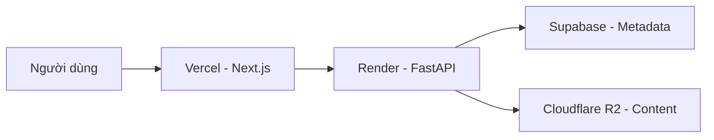

# Mạt Thế - Sinh Hoá Nguy Cơ ☣️

> *"Trong bóng tối của ngày tận thế, chỉ có ý chí mới cứu rỗi nhân loại..."*

Website đọc truyện chữ chuyên nghiệp — **Zero-cost · 1000+ CCU · Biohazard UI**

## 🏗️ Kiến Trúc



## 📁 Cấu Trúc Thư Mục

- `frontend/`: Giao diện ứng dụng (Next.js 15, Tailwind CSS)
- `backend/`: Máy chủ API (FastAPI, Python)
- `scripts/`: Công cụ xử lý dữ liệu tự động
- `.brain/`: Hệ thống kiến thức và ghi chú dự án

## 🚀 Khởi Động Nhanh

### 💻 Frontend
```bash
cd frontend
npm install
npm run dev
```

### 🐍 Backend
```bash
cd backend
pip install -r requirements.txt
uvicorn main:app --reload
```

## 🗺️ Bản Đồ Chiến Sự (Interactive Map)

Hệ thống cung cấp một bản đồ tương tác theo dõi diễn biến thế giới, sử dụng **Leaflet.js** và **react-leaflet**.

### Tính Năng Chính
- **Đánh dấu địa điểm**: Vùng an toàn, ổ dịch, trạm tiền tiêu, tàn tích...
- **Bản Đồ Hệ Thống (Custom Map Background)**: Cho phép admin upload hình ảnh bản đồ riêng (tỷ lệ chuẩn 16:9) để phủ lên làm nền bản đồ thế giới.
- **Tọa độ Neo (Map Bounds)**: Để đảm bảo render ảnh 16:9 không bị co bóp/méo dọc, hệ thống cố định `MAP_BOUNDS` ở tọa độ `[[0, 90], [27, 138]]` (ΔLng=48 / ΔLat=27 ≈ 1.77).

### 🛠️ Cấu hình DB (Supabase `map_locations`)
Để tính năng **Bản Đồ Hệ Thống** hoạt động, bắt buộc phải thiết lập `CHECK constraint` trên cột `type` để database chấp nhận giá trị `system_map`:

```sql
ALTER TABLE map_locations DROP CONSTRAINT IF EXISTS map_locations_type_check;
ALTER TABLE map_locations ADD CONSTRAINT map_locations_type_check 
  CHECK (type IN ('safe_zone', 'danger_zone', 'neutral', 'outpost', 'ruins', 'system_map'));
```

## 🌐 Triển Khai (Deployment)

- **Frontend:** Tự động triển khai qua [Vercel](https://vercel.com) khi push code lên GitHub.
- **Backend:** Chạy trên [Render](https://render.com) kết nối trực tiếp với database Supabase.

---
**Status:** ✅ Đã hoàn tất cấu hình tên miền chính thức.
**Last Update:** 03/13/2026.