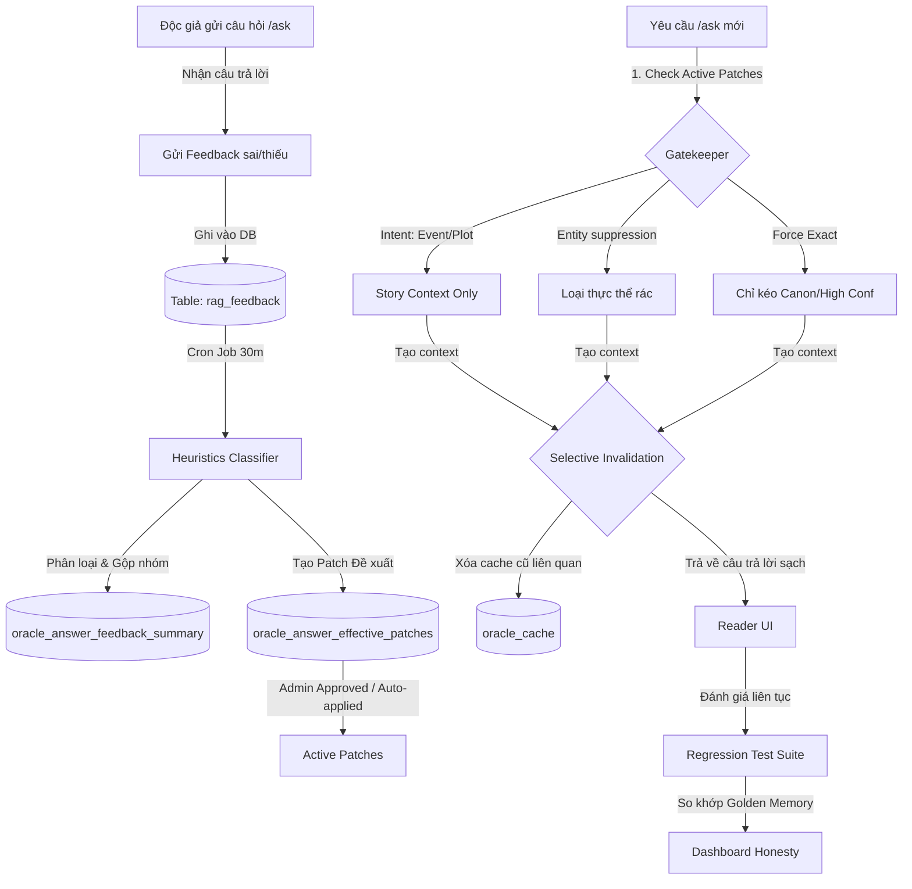

# Kiến Trúc Tự Học AGI-Like Cho AI Oracle (Oracle AGI-Like Self-Learning Architecture Plan)

Tài liệu này vạch ra thiết kế kiến trúc và triết lý lõi để chuyển đổi hệ thống tự học hiện tại của AI Oracle thành một kiến trúc tiệm cận AGI (AGI-like) — hướng tới khả năng tự chữa lành, tự tiến hóa, tự đánh giá hồi quy và hoạt động dựa trên bằng chứng cốt truyện, đảm bảo kiểm chứng thực tế ở runtime production.

---

## 1. Triết Lý Cốt Lõi (Luật Thép)

Kiến trúc này được xây dựng trên 7 quy tắc nền tảng:

1. **Độc giả là Cảm biến (Reader as Sensor)**: Mỗi câu hỏi, phản hồi (feedback) và xếp hạng (like/dislike) của độc giả là một tín hiệu phản hồi giúp hệ thống phát hiện lỗi và lỗ hổng kiến thức.
2. **Admin là Người giám sát (Supervisor, not Bottleneck)**: Hệ thống tự động phân loại, đề xuất bản vá (patch) và chạy tự động. Admin/Tác giả đóng vai trò phê duyệt cấp cao (high-level gatekeeper) thông qua các đề xuất tự sinh, không phải thực hiện thao tác thủ công phức tạp.
3. **runtime Truth Proof (Bằng chứng Runtime thực tế)**: Phản hồi chưa được coi là đã học (resolved) nếu production output chưa đổi đúng. Không tin tưởng vào kết quả kiểm tra cục bộ (local-only tests).
4. **Evidence-First (Bằng chứng là trên hết)**: Nếu không có bằng chứng (evidence) xác thực từ chương truyện hoặc Canon Wiki, Oracle tuyệt đối không được tự bịa hoặc trả lời một cách chắc chắn. Thà nhận "chưa đủ dữ liệu" còn hơn đưa thông tin rác.
5. **Chống hồi quy (Regression Prevention)**: Mọi lỗi cũ được ghi lại thành Golden Test Case. Các thay đổi hoặc tự học mới không được phép phá vỡ (regress) các câu trả lời đã sửa trước đó.
6. **Khả năng khôi phục (Rollback Ability)**: Mọi module ghi dữ liệu (write pipeline) bắt buộc phải đi kèm cơ chế khôi phục trạng thái cũ (rollback) để tránh việc tự học làm hỏng dữ liệu hệ thống.
7. **Khử nhiễm ngữ cảnh (No Raw System Context)**: Không bao giờ để lộ các thẻ thô của hệ thống retrieval (như `[CANON WIKI]`, `[THƯ VIỆN TỰ ĐỘNG]`, `chunk_index`) cho độc giả thường.

---

## 2. Sơ Đồ Kiến Trúc Hệ Thống (Architecture Flow)

Dưới đây là sơ đồ luồng dữ liệu tự học khép kín từ cảm biến (sensor) đến runtime proof:

---

## 3. Các Module Thành Phần Lõi

### A. Feedback Classifier & Patch Registry
- **Heuristics Classifier**: Module tự động phân tích ý định (intent) của feedback dựa trên từ khóa tiếng Việt của người đọc (ví dụ: "linh tinh", "sai ý", "cũ", "thiếu chi tiết").
- **Patch Registry**: Nơi lưu giữ các chính sách runtime (policies) bao gồm:
  - `prefer_chapter_summary_intent`: Ép hệ thống dùng tóm tắt chương thay vì danh sách thực thể.
  - `suppress_irrelevant_entity_expansion`: Chặn việc bành trướng thực thể khi câu hỏi chứa từ khóa hẹp.
  - `force_exact_entity_lookup`: Chặn kết quả OR yếu khi hỏi định danh thực thể.
  - `clear_stale_cache`: Khóa ép xóa cache khi nội dung cốt truyện cập nhật.

### B. Runtime Truth Gate
- Đóng vai trò là bộ lọc cuối cùng (guardrail) trước khi Context được gửi tới LLM hoặc trả trực tiếp về client.
- Lọc bỏ các thực thể có độ tin cậy yếu (`weak_evidence`) hoặc bị cộng đồng gắn cờ cảnh báo (`warn_record`).
- Chặn đứng các thực thể bị cấm (blacklist/suppressed) xuất hiện trong câu hỏi cụ thể.

### C. Golden Regression Memory
- Một tập hợp các ca kiểm thử hồi quy được lưu trữ trực tiếp trong mã nguồn và DB (`oracle_self_learning_regression_pack.py`).
- Đảm bảo rằng việc tự học và tự tạo patch mới không làm hỏng các case đã fix thành công trước đó (bảo vệ production khỏi lỗi suy giảm chất lượng).

### C. Telemetry & Tele-monitoring
- Ghi lại vết truy cập: `source` (cache, local_wiki, ai_provider) và headers `Cache-Control`.
- Đẩy dữ liệu giám sát trực tiếp ra Dashboard, báo cáo độ trung thực của AI Oracle (chạy thật hay chỉ là mô phỏng).
