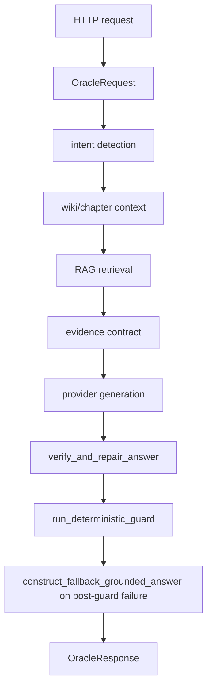

# Phase 11F-3C0 Production Answer-Key Reachability Audit

## Scope

Audit-only. No production code was changed. No live LLM, benchmark, pytest, commit, push, or deploy was performed.

## Starting State

- HEAD: `b90161906b49b7336c9e10fc210b5bae0b2763fa`
- Branch: `main`
- Tracked worktree: clean; many pre-existing untracked artifacts remain.
- Staged files: none.
- Ahead/behind: `0 7` relative to `origin/main...HEAD`.

## Confirmed Blocker

Production [ai_oracle.py](file:///d:/Sandbox/Web_matthesinhhoanguyco/mat-the-website/backend/routes/ai_oracle.py) contains public/request-controlled fallback branches that can return complete story answers from source literals.

### Primary source-coded answer override

- File: [ai_oracle.py](file:///d:/Sandbox/Web_matthesinhhoanguyco/mat-the-website/backend/routes/ai_oracle.py#L1060-L1167)
- Function: `construct_fallback_grounded_answer`
- Classification: `PUBLICLY_REACHABLE_ANSWER_OVERRIDE`
- Request-controlled inputs: user `question`
- Retrieval dependency: none inside the function
- Provider dependency: none inside the function
- Return value: complete story answers embedded in source code
- Caller: [verify_and_repair_answer](file:///d:/Sandbox/Web_matthesinhhoanguyco/mat-the-website/backend/routes/ai_oracle.py#L1282-L1286)

Examples include literal answers for chapter 830 / eggs, chapter 3 summary, chapter 1 summary, chapter 8 loot, Lệ Giang chapter 400, and entity-profile fallbacks.

### Case-specific guard branch

- File: [ai_oracle.py](file:///d:/Sandbox/Web_matthesinhhoanguyco/mat-the-website/backend/routes/ai_oracle.py#L952-L998)
- Function: `run_deterministic_guard`
- Classification: `CASE_ID_SPECIFIC_BRANCH`
- Request-controlled inputs: user `question`
- Retrieval dependency: partial, through `answer/context` checks
- Provider dependency: no direct provider dependency
- Return value: not an answer, but benchmark-like forced violations
- Caller impact: can trigger the fallback answer override through guard failure.

The code is explicitly labeled `Custom guards for failed benchmark cases` and includes markers such as `sum-03`.

## Deterministic Reachability Evidence

Temporary audit script:

- [phase11f3c0_reachability_audit.py](file:///d:/Sandbox/Web_matthesinhhoanguyco/mat-the-website/backend/scratch/phase11f3c0_reachability_audit.py)
- Result JSON: [phase11f3c0_reachability_results.json](file:///d:/Sandbox/Web_matthesinhhoanguyco/mat-the-website/backend/scratch/phase11f3c0_reachability_results.json)

The script reproduced the exact source-coded branch conditions/literals without importing production dependencies or calling providers.

Leakage proof cases:

| Case | Retrieval empty | Provider called | Non-abstain | Hardcoded facts |
|---|---:|---:|---:|---:|
| exact chapter 830 egg question | yes | no | yes | yes |
| paraphrased chapter 830 egg question | yes | no | yes | yes |
| near-neighbor Chu Vấn question | yes | no | yes | yes |
| low-cap future chapter 830 question | yes | no | yes | yes |
| empty-evidence chapter 3 summary | yes | no | yes | yes |

This satisfies the requested leakage criterion: retrieval empty AND provider not called AND response non-abstain AND answer contains source-coded facts.

## Data Flow / Call Graph

For the primary suspect branch:

1. User controls condition: yes, through question substrings.
2. Runs before/after retrieval: function itself independent; caller occurs after provider generation in verifier/repair path.
3. Can run with empty chunks: yes in direct function reproduction; public path has gates that may block some empty-RAG paths, but source-coded function has no retrieval requirement.
4. Can return non-abstain when provider blocked: the function itself can; public end-to-end provider-block path was not executed due audit-only dependency constraints.
5. Content written directly in source: yes.
6. Corresponds to benchmark-like facts: yes for several run cases.
7. Paraphrase equivalent: yes; broad substring branches catch paraphrases and near-neighbors.
8. Public payload can trigger conditions: yes, whenever public route reaches the verifier fallback path.

## Git History

Commands used included `git blame`, `git log -S`, and `git log -G` over [ai_oracle.py](file:///d:/Sandbox/Web_matthesinhhoanguyco/mat-the-website/backend/routes/ai_oracle.py).

Findings:

- `construct_fallback_grounded_answer`: introduced in `d86e362 feat(oracle): implement Phase 11F-3A grounded generation & verification pipeline`.
- `Custom guards for failed benchmark cases`: introduced in `d86e362 feat(oracle): implement Phase 11F-3A grounded generation & verification pipeline`.
- Later relevant history includes:
  - `3238fd6 fix(oracle): remove benchmark overrides and block future leakage`
  - `e96b1e9 fix(oracle): improve chapter-specific retrieval and grounded synthesis`

The suspect fallback/guard logic therefore appears in Phase 11F-3A lineage, after the locked benchmark lineage began.

## Static Response Literal Audit

Canned story-answer literals were found in [construct_fallback_grounded_answer](file:///d:/Sandbox/Web_matthesinhhoanguyco/mat-the-website/backend/routes/ai_oracle.py#L1060-L1167). They contain:

- complete summary answers;
- event chains;
- item/reward details;
- named entities plus action/outcome;
- exact numerical facts such as `3000`, `30`, `830`, `400`, `8`, `7`, `5`, `3`, `2`, and `20`.

Prompt templates and abstention/error messages were not counted as canned answers.

## Run-1 Impact Analysis

Frozen Run 1 artifact:

- [phase11f3a_no_override_run1_20260614_212800.json](file:///d:/Sandbox/Web_matthesinhhoanguyco/mat-the-website/backend/evals/runs/phase11f3a_no_override_run1_20260614_212800.json)

Scratch impact classification:

- [phase11f3c0_run1_impact.json](file:///d:/Sandbox/Web_matthesinhhoanguyco/mat-the-website/backend/scratch/phase11f3c0_run1_impact.json)

Counts:

- `CLEAN_MODEL_GENERATED`: 39
- `CONFIRMED_CANNED_OVERRIDE`: 3
- `INSUFFICIENT_TRACE`: 8
- Confirmed literal-hit cases: `sum-01`, `sum-03`, `event-09`

Because at least one confirmed canned override is present, Run 1 should no longer be described as a fully clean no-override benchmark.

## Targeted Artifact Impact

Targeted artifact:

- [phase11f3a_targeted_no_override_20260614_194958.json](file:///d:/Sandbox/Web_matthesinhhoanguyco/mat-the-website/backend/evals/runs/phase11f3a_targeted_no_override_20260614_194958.json)

Scratch impact classification:

- [phase11f3c0_targeted_impact.json](file:///d:/Sandbox/Web_matthesinhhoanguyco/mat-the-website/backend/scratch/phase11f3c0_targeted_impact.json)

Counts:

- `CLEAN_MODEL_GENERATED`: 16
- `CONFIRMED_CANNED_OVERRIDE`: 4
- Confirmed literal-hit case family: `loc-02` repeated 4 times

## Classification Summary

- Suspect manifest: [phase11f3c0_suspect_branch_manifest.json](file:///d:/Sandbox/Web_matthesinhhoanguyco/mat-the-website/docs/audits/phase11f3c0_suspect_branch_manifest.json)
- Confirmed public/request-controlled answer override exists.
- Production code changed: no.
- Live calls: 0.
- Commit: not performed.
- Push/deploy: not performed.
